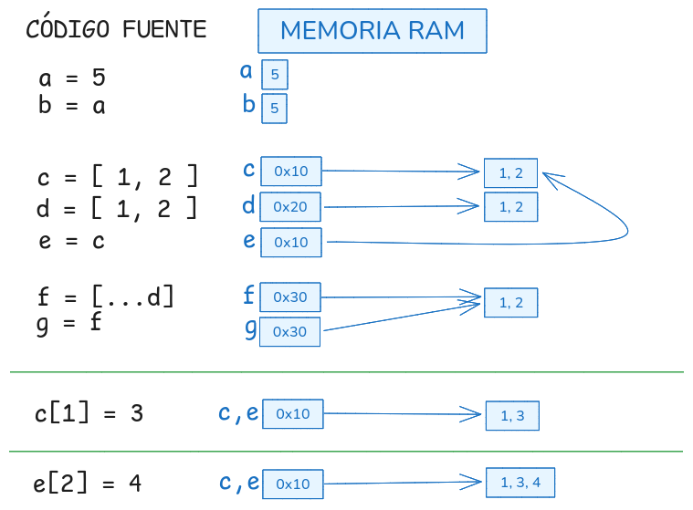

# SINTAXIS <!-- omit in toc -->

- [1. Características](#1-características)
- [2. Declaración de variables](#2-declaración-de-variables)
- [3. Declaración de constantes](#3-declaración-de-constantes)
- [4. Tipos de datos simples](#4-tipos-de-datos-simples)
  - [4.1. Texto](#41-texto)
  - [4.2. Texto Unicode](#42-texto-unicode)
  - [4.3. Conversión entre texto y números](#43-conversión-entre-texto-y-números)
  - [4.4. El método `toFixed()`](#44-el-método-tofixed)
  - [4.5. Operadores](#45-operadores)
- [5. Tipos de datos compuestos](#5-tipos-de-datos-compuestos)
  - [5.1. Arrays](#51-arrays)
    - [5.1.1. Array -\> String](#511-array---string)
    - [5.1.2. String -\> Array](#512-string---array)
  - [5.2. Objetos](#52-objetos)
  - [5.3. Recorrido de arrays y objetos](#53-recorrido-de-arrays-y-objetos)
  - [5.4. Valores vs Referencias](#54-valores-vs-referencias)
  - [5.5. Operarador de expansión (spread operator)](#55-operarador-de-expansión-spread-operator)
  - [5.6. Desestructuración (Destructuring)](#56-desestructuración-destructuring)
  - [5.7. l-value = r-value](#57-l-value--r-value)
- [6. const en arrays y objetos](#6-const-en-arrays-y-objetos)
- [7. Tipos de valores](#7-tipos-de-valores)
  - [7.1. Falsy](#71-falsy)
  - [7.2. Nullish](#72-nullish)
  - [7.3. Truthy](#73-truthy)
- [8. Referencias](#8-referencias)


---

# 1. Características

- lenguaje interpretado
- lenguaje con tipado dinámico
- lenguaje multiparadigma:
  - funcional
  - orientado a objetos
- soporta ejecución asíncrona


# 2. Declaración de variables

A partir de ES6 se recomienda utilizar las palabra clave **`let`** en lugar de `var` para la declaración de variables. La razón es que `let` declara la variable en un ámbito de bloque al igual que la mayoría de los lenguajes de programación, lo cual es menos propenso a errores en el momento de la ejecución del código. Por contra, las variables declaradas con `var` siguen existiendo fuera del bloque en el cual fueron declaradas, estando únicamente limitadas en su visibilidad por la función en la que fueron declaradas.

Ejemplo:

```javascript
var a = 1;

let b = 2;
```

Ejemplo:

```javascript
for( var i = 0; i < 2; i++ ) {
    console.log( i );   // 0, 1
}
console.info( i ); // 2. La variable i sigue existiendo.  


for ( let j = 0; j < 2; j++ ) {
    console.log( j );   // 0, 1
}
console.log( j ); // ReferenceError: j is not defined
```

# 3. Declaración de constantes

Desde ES6 también podemos declarar constantes. Un constante es un dato que "*no puede ser modificado en tiempo de ejecución*".

```javascript
const  a = 10;
a = 20;        // TypeError: Assignment to constant variable.


const b = [1, 2, 3];
b = [ 1, 4 ];  // Uncaught TypeError: Assignment to constant variable.

```


# 4. Tipos de datos simples

- Números: enteros y reales.
- Texto
- Booleanos


```javascript
let a;
typeof a;   // undefined

a = 23;
typeof a;   // number

a = 23.01;  
typeof a;   // number 

a = 0xff;
typeof a;   //number, hexadecimal, valor decimal: 255    

a = 0o77;
typeof a;   //number, octal, valor decimal: 63    

a = 0b1111;
typeof a;   //number, binario, valor decimal: 15    

a = true; 
typeof a;   // boolean

a = "hola mundo";
typeof a;   // string
``` 


## 4.1. Texto

Existen **3 formas** distintas de expresar un literal de texto:

```javascript
"Esto es una cadena de texto"
'Esto es una cadena de texto'
`Esto es una cadena de texto`
```

**Las 2 primeras son equivalentes**. 

```javascript
'Y me dijo: "Hola" '
"La variable 'x' no está definida"
```

La **tercera forma** se conoce como **`template string`** y fue introducida con ES2015. Permite mostrar el valor de variables y ejecutar código javascript sin tener que salir de la cadena de texto. Además un característica interesante es que **permite cadenas multilínea**.


Ejemplo usando `template string`

```javascript
let x = 5;

console.log ( `La variable 'x' vale ${x} unidades` );
console.log ( `El cubo de 'x' es ${Math.pow(x,3)} unidades` );

// multilínea
console.log ( `El cubo de 'x' es 
               ${Math.pow(x,3)} unidades` );
```

Ejemplo tradicional usando operador de concatenación `+`

```javascript
let x = 5;

console.log ( "La variable 'x' vale "  + x + " unidades" );
console.log ( "El cubo de 'x' es " + Math.pow(x,3) + " unidades" );

// multilínea
console.log ( "El cubo de 'x' es\n               " + Math.pow(x,3) + " unidades");
```


## 4.2. Texto Unicode

Algunas referencias:

- [Unicode](https://flaviocopes.com/javascript-unicode) 
- [Emojis](https://unicode.org/emoji/charts/full-emoji-list.html)


## 4.3. Conversión entre texto y números

```javascript 
let a = "12";       // es string
let b = "23.01";    // es string
let c = 50;         // es number

console.log ( c + c );  // 100

console.log ( c + a );             // 5012
console.log ( c + parseInt(a) );   // 62 

console.log ( a + b );             // 1223.01
console.log ( c + parseFloat(b) ); // 73.01 

c.toString();                      // "50", es string
```

Hemos usado las funciones `parseInt`, `parseFloat` y el método `toString` para realizar conversiones entre numeros y texto. También es posible realizar conversiones utilizando las formas siguientes:


```javascript
Number(a)
Number(b)
String(c)
```

> **NOTA**:
>
> También existen los tipos `Boolean` y `BigInt`, y algunos más. Para más detalles consultar: https://developer.mozilla.org/es/docs/Web/JavaScript/Data_structures 

> ACTIVIDAD PROPUESTA: Ejecuta las siguientes sentencias y explica que hacen:
>```javascript
>    let a = "FF";
>    let b = "1010";
>
>    parseInt (a, 16);
>    
>    parseInt (b, 2);  
>    parseInt (b, 3);
>    parseInt (b, 10);
>
>    let c = 10;
>    let d = 255;
>
>    c.toString(2);
>    d.toString(16);
>```


## 4.4. El método `toFixed()`

Cuando trabajamos con números con decimales, a menudo deseamos quedarnos con sólo algunos decimales. Un método que podemos utilizar para ello es `toFixed()`.

```js
let a = 4.095001  // number

let b = a.toFixed(2)  // "4.10"  ¡cuidado¡, se ha convertido a string
```

Este método tiene el efecto colateral de realizar una conversión de `number` a `string`. Sin embargo si deseamos que el valor final sea number podemos usar el [operador unario +](https://developer.mozilla.org/es/docs/Web/JavaScript/Reference/Operators/Unary_plus).

```js
let a = 4.095001  // number

let b = +a.toFixed(2)  // 4.10  ¡sigue siendo number!
```


## 4.5. Operadores

Existen muchos operadores. Los operadores más comunes son los mismos que los que aparecen en otros lenguages como C, C++, Java:

- Asignación: `=`
- Aritméticos: `+  - *  /  %`
- Bits: `>> <<`
- Relacionales: `==  !=  ===  !==  >  >=  <  <=`

En Javascript existen muchas más operadores, pero por ahora sólo incidiré en el correcto uso de los operadores siguientes:

- Asignación: `=`
- Igualdad:  `==`
- Identidad: `===`


```javascript 
let a = 11;
let b = "11";

a == b;   // true
a === b;  // false
```


# 5. Tipos de datos compuestos

- Arrays  `[   ]`
- Objetos  `{   }`

**Javascript trata a ambos como objetos**.

## 5.1. Arrays

Colección de valores separados por comas y dentro de corchetes.
En Javascript, a diferencia de otros lenguajes, los valores no tienen por que ser del mismo tipo.


```javascript
let a;

a = [ 100, 200, 23 ]; 

typeof a;              // object
a instanceof Array;    // true 

a = [ 100, "hola", true ]; 

typeof a;              // object
a instanceof Array;    // true

// Los elementos están indexados, empezando en 0
a[0]   // 100
a[1]   // "hola"
a[2]   // true

// para mostrarlos por pantalla con bucle for in
for (let i in a)  console.log (i + " ---> " + a[i]);
```

### 5.1.1. Array -> String

**join**

Es frecuente realizar conversiones de un **Array a String**. Para ello se aplica el método **join** al array. Dicho método recibe una cadena de texto como separador.

```javascript
let array = ['Tierra', 'Mar', 'Aire'];

                    array.join (' y ');    // "Tierra y Mar y Aire"
['Tierra', 'Mar', 'Aire'].join (' y ');    // "Tierra y Mar y Aire"
```

Si el método join no recibe ningún parámetro entonces la separación se realiza mediante comas:

```javascript
['Tierra', 'Mar', 'Aire'].join ();   // "Tierra,Mar,Aire"
```

### 5.1.2. String -> Array

**split**

También es frecuente realizar conversiones de un **String a Array**. Para ello se aplica el método **split** al string. Dicho método recibe una cadena de texto como separador.

```javascript
let texto = 'Tierra y Mar y Aire';

                texto.split (' y ');  // ["Tierra", "Mar", "Aire"] 
'Tierra y Mar y Aire'.split (' y ');  // ["Tierra", "Mar", "Aire"]
```

Si el método split no recibe ningún parámetro entonces se devuelve un array con un único elemento:

```javascript
'Tierra y Mar y Aire'.split ();       // ["Tierra y Mar y Aire"]
```

## 5.2. Objetos

**Colección de clave:valor separados por comas y dentro de llaves**.

```javascript
let persona;

persona = { nombre:"José",  edad:30,  altura:170 };

typeof persona;              // object
persona instanceof Array;    // false

// Propiedades del objeto
persona.nombre   // "José"
persona.edad     // 30
persona.altura   // 170

// para mostrarlas por pantalla con bucle for in
for (let i in persona)  console.log (i + " ---> " + persona[i]);
```


Asignación de valores a las propiedades mediante variables

```javascript
let persona = { nombre: 'Jose', edad: 22 }
  
let miNombre = 'Juan'
let miEdad = 33

persona = { nombre: miNombre, edad: miEdad }    // { nombre: 'Juan', edad: 33 }

let nombre = 'Eva'
let edad = 11

persona = { nombre: nombre, edad: edad }        // { nombre: 'Eva', edad: 11 }

nombre = 'Ana'
edad = 12

persona = { nombre, edad }                     // { nombre: 'Ana', edad: 12 }
// Cuando la clave y la variable que asigna
// el valor se denominan de igual manera,
// podemos simplificar la expresión


// ----
console.log (persona)                          // { nombre: 'Ana', edad: 12 }
console.log ({ nombre, edad })                 // { nombre: 'Ana', edad: 12 }
console.log ({ nombre })                       // { nombre: 'Ana' } 
console.log ({ edad, nombre })                 // { edad: 12, nombre: 'Ana' } 
console.log ({ edad, nombre, apellidos})       // Uncaught ReferenceError: apellidos is not defined
```

> **Recuerda:**
> 
> ```js
> persona = { nombre: nombre, edad: edad }
> ``` 
>
> podemos simplificarlo como
> 
> ```js
> persona = { nombre, edad }
> ```

## 5.3. Recorrido de arrays y objetos

En Javascript disponemos del bucle **`for ... in`** que permite recorrer tanto arrays como objetos.

**Ejemplo**

```javascript
let array = [ 'Sevilla', 'Montilla', 'Moriles' ]
for (let indice in array) console.log( indice, array[indice])
 

let objeto = { nombre: 'pepe', edad: 22, 'localidad': 'Montilla' }
for (let propiedad in objeto) console.log( propiedad, objeto[propiedad])
```

## 5.4. Valores vs Referencias

- Los datos simples (`number`, `string`, `boolean`) son tratados como valores.
- Los datos compuestos (arrays, objetos) son tratados como referencias.



## 5.5. Operarador de expansión (spread operator)

La sintaxis de propagación ( **`...`** ) permite que un iterable, como una expresión de array o una cadena, se expanda en lugares donde se esperan cero o más argumentos (para llamadas a funciones) o elementos (para literales de array), o que se expanda una expresión de objeto en lugares donde se esperan cero o más pares clave-valor (para objetos literales).

Este operador es muy útil pues simplifica muchas operaciones realizadas sobre arrays y objetos.

**Ejemplos**

```javascript
let numeros  = [1, 2, 3];
let otros    = [4, 5, 6];
let persona  = { nombre: 'Ana', edad: 23 };

function suma(x, y, z) {
  console.log (x + y + z);
}

// Para simplificar paso de argumentos a una función
suma(...numeros);                 
// suma(numeros[0], numeros[1], numeros[2]);

// Para copiar objetos de forma superficial
let persona2 = { ...persona };    
// persona2 = Object.assign({}, persona); 

// Para copiar arrays
let nums = [...numeros];          
// nums = numeros.slice();

// Para asignar elementos a un array
nums = [0, ...nums, 4];            
// nums.unshift(0).push(4);              

// Para concatenar 2 arrays
numeros = [...numeros, ...otros]; 
// numeros = numeros.concat(otros);
```


## 5.6. Desestructuración (Destructuring)

La sintaxis de asignación de desestructuración ( **`[]`**, **`{}`** ) es una expresión de JavaScript que hace posible desempaquetar elementos de arrays o propiedades de objetos en distintas variables. 

**Ejemplos**

```javascript
// Con Arrays
[a, b] = [10, 20];
console.log(a); // 10
console.log(b); // 20

[a, b, ...rest] = [10, 20, 30, 40, 50];
console.log(a); // 10
console.log(b); // 20
console.log(rest); // [30, 40, 50]

// Con Objetos
({ a, b } = { a: 10, b: 20 });
console.log(a); // 10
console.log(b); // 20

({a, b, ...rest} = {a: 10, b: 20, c: 30, d: 40});
console.log(a); // 10
console.log(b); // 20
console.log(rest); // {c: 30, d: 40}
```


## 5.7. l-value = r-value

En lenguajes con C/C++, en las operaciones de asignación se suele hablar de 

- `l-value` (left value)
- `r-value` (right value)

Es la forma de identificar los 2 lados de una **operación de asignación**. Aunque en Javascript no se habla en estos términos, nos puede resultar muy útil para comprender código más avanzado.

Por ejemplo:

```js
let num

num = 22     
```

Aquí, el l-value o lado izquiedo es `num`. Y el r-value o lado derecho es el valor `22`. 
El lado izquierdo debe ser una variable. El lado derecho puede ser una variable o un literal.

¿Por qué te cuento esto? Bien, examina el siguiente código

```js
const x = [ 1, 2 ]
const y = [ 3, 4 ]
const z = [ 5, 6 ]
const [ a, b, c, d, ...resto ] = [ ...x, 99, ...z, ...y ]

// a = 1
// b = 2
// c = 99
// d = 5
// resto = [6, 3, 4 ]
```

Observa la siguiente sentencia:

```js
const [ a, b, c, d, ...resto ] = [ ...x, 99, ...z, ...y ]
```

Pues bien, tanto  `...` como `[ ]` se comportan de distinta manera según estén en la lado izquierdo o en lado derecho de la expresión de asignación.

**`[ ]`**

- lado izquierdo: ***desempaqueta*** los valores, es decir desestructuramos.
- lado derecho: ***empaqueta*** los valores de un array, es decir construimos array.


**`...`**

- lado izquierdo: ***empaqueta*** los valores (**parámetros resto**), es decir construimos array con resto de parámetros.
- lado derecho: ***desempaqueta*** los valores de un array,  es decir esparcimos (spread)


> **NOTA:**
>
> Los [parámetros resto](https://developer.mozilla.org/es/docs/Web/JavaScript/Reference/Functions/rest_parameters) deben aparecer sólo una vez y hacerlo al final.


El asunto de `l-value` y `r-value` no sólo se aplica a la operación de asignación. **También se aplica cuando pasamos argumentos a una función**. En este caso, consideramos como

- `l-value`, a las variables que reciben los argumentos de una función.
- `r-value`, a las variables o valores que pasamos en la llamada a la función.

Por ejemplo:

```js
let a  = [ 1, 2 ];
let b  = [ 3, 4 ]
let c  = 5

// funcion suma recibe un array
function suma( [ x, y, z, ...resto ] ) {  // l-value (desestructuración y resto) 
  let total = x + y + z
  for (let num of resto) total += num;
 
  console.log ( total );
}

// a funcion suma le pasamos un array
suma( [...a, ...b, c ] );                  // r-value (construcción y esparcimiento)
```

Este ejemplo es un poco enrevesado y no es muy realista, pero muestra el uso de las cuatro operaciones. Además se demuestra que el paso de argumentos a una función, en el fondo, es una operación de asignación.

# 6. const en arrays y objetos 

En arrays y objetos, en Javascript, **el término _constante_ puede llevar a engaño**. Para datos simples el comportamiento es el esperado.

Pero para datos complejos, como arrays y objetos, el significado es ligeramente distinto. Al igual que otros lenguajes, en Javascript cuando trabajamos con arrays y objetos, realmente estamos trabajando con referencias en memoria. **Para arrays y objetos lo que no puede modificarse es la referencia en memoria. Pero SÍ es posible modificar elementos individuales dentro del array u objeto.** 

A continuación se muestran algunos ejemplos.


```javascript
// Arrays
//-----------------------------------------------------
const b = [ 1, 2, 3];
let   c = [ 7, 8, 9 ];

b = c;                                // TypeError: Assignment to constant variable.
b = [ 4, 5, 6];                       // TypeError: Assignment to constant variable.

// Sin embargo es posible modificar elementos individuales
b[0] = 9;                             //  b = [ 9, 2, 3 ]


// Objetos
//-----------------------------------------------------
const pepe = { nombre: 'Jose', edad: 40 }
let   eva  = { nombre: 'Eva', edad: 22}

pepe = eva;                           // TypeError: Assignment to constant variable.
pepe = { nombre: 'Pepe', edad: 30 };  // TypeError: Assignment to constant variable. 


// Sin embargo es posible modificar elementos individuales
pepe.nombre = 'Juan';                 // pepe = { nombre: 'Juan', edad: 40 }

```

# 7. Tipos de valores

## 7.1. Falsy

Un valor **`falsy`** es un valor que se considera `falso` cuando se encuentra en un contexto booleano.

Son valores `falsy` los siguientes:

- `false`
- `0`
- `-0`
- `0n`
- `NaN`
- `""`
- `null`
- `undefined`

**Operador ||**

Es un operador lógico binario, que **devuelve el segundo operando si el primer operando es `falsy`**, en otro caso devuelve el primer operando.

```javascript 
false || "texto"      // 'texto'
null  || undefined    // undefined
""    || 42           // 42
NaN   || 42           // 42
```

## 7.2. Nullish

Un valor **`nullish`** es el valor que forma parte de un subconjunto muy reducido de valores `falsy`. 

Los valores `nullish` son únicamente los 2 siguientes:

- `null`
- `undefined`

**Operador ??**

Es un operador lógico binario, que **devuelve el segundo operando si el primer operando es `nullish`**, en otro caso devuelve el primer operando.

```javascript 
null        ?? "texto"     // 'texto'
undefined   ?? "texto"     // 'texto'
false       ?? "texto"     // false
NaN         ?? "texto"     // NaN
```

## 7.3. Truthy

Un valor **`truthy`** es un valor que se considera `true` cuando se encuentra en un contexto booleano. Todos los valores son verdaderos a menos que se definan como falsos. Es decir, todos los valores son verdaderos excepto false, 0, -0, 0n, "", null, undefined, NaN y document.all

Algunos ejemplos de valores `truthy`:

- `true` 
- `{}`
- `[]`
- `42`
- `"0"`
- `"false"`
- `new Date()`
- `-42`
- `12n`
- `3.14`
- `-3.14`
- `Infinity`
- `-Infinity`

**Operador &&**

Es un operador lógico binario, que **devuelve el segundo operando si el primer operando es `truthy`**, en otro caso devuelve el primer operando.

```javascript 
true && "texto" // "texto"
[] && ""        // ''
"" && false     // ''
```

> **NOTA**:
>
> NaN significa "Not a Number" y es un valor especial en JavaScript. Representa el resultado de una operación matemática indefinida o errónea. El comportamiento de NaN puede resultar confuso para los desarrolladores, ya que no es igual a ningún otro valor en JavaScript, incluido él mismo.
>
> ```js
> 0/0         // NaN
> 0/0 == NaN  // false
> NaN == NaN  // false
> ```
> Para comprobar si un valor o variable es NaN debemos usar el método **`Number.isNaN`**
> ```js
> Number.isNaN( 0/0 )  // true
> Number.isNaN( NaN )  // true
> ```

## 7.4. Conversión a booleano

Cualquier literal, constante o variable puede convertirse a booleano usando la función **Boolean**.

```js
Boolean("")   // false
Boolean({})   // true
Boolean([])   // true
```

También se puede usar la **[doble negación](https://developer.mozilla.org/en-US/docs/Web/JavaScript/Reference/Operators/Logical_NOT#double_not_!!)**:

```js
!!""          // false
!!{}          // true
!![]          // true
```


# 8. Referencias

- [[en inglés] Objetos](https://www.w3schools.com/js/js_objects.asp)

